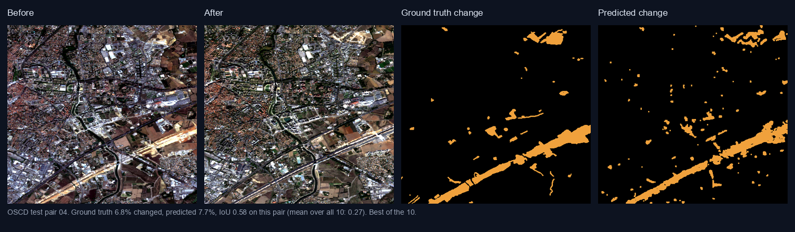
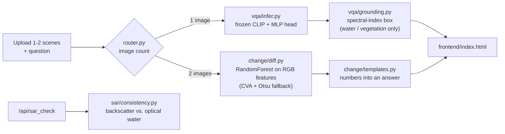
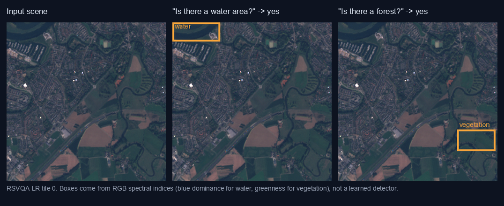
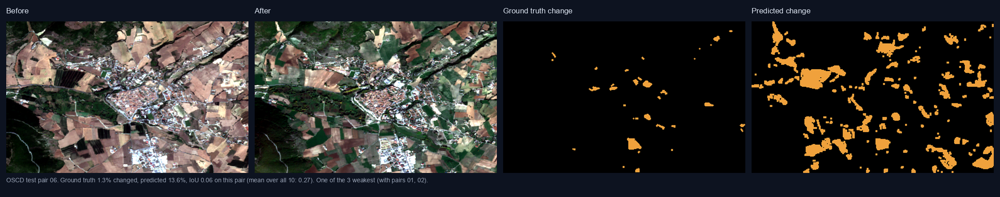
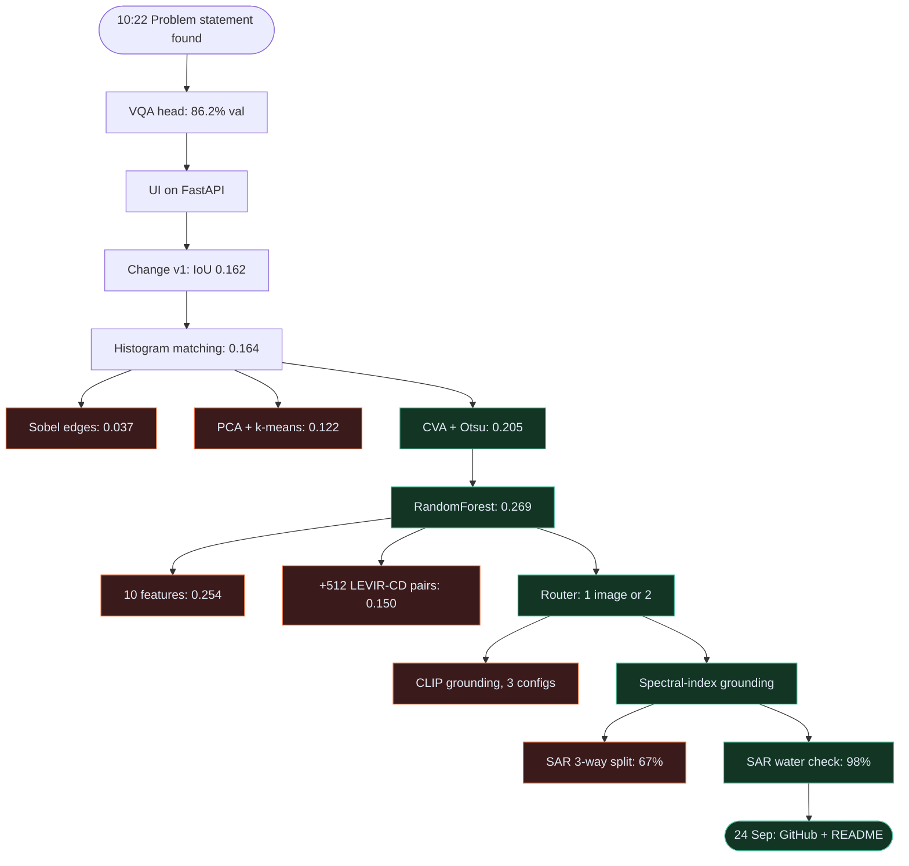

# SatQuery

**Ask a satellite image a question.** Upload one scene and get an answer with visual evidence. Upload two and get a change analysis. One query box, and the system decides which pipeline to run.


Built for ISRO / Space Applications Centre problem statement **SIH26167, "SatQuery AI: an interactive vision-language assistant for multimodal remote sensing image analysis through text queries."**



*Real output on a held-out test pair from OSCD (Sentinel-2). This is the best of the 10 test pairs; the failure case is [further down](#where-it-fails).*

---

## Contents

- [What it does](#what-it-does)
- [How it works](#how-it-works)
- [Results](#results)
- [Where it fails](#where-it-fails)
- [Coverage of the problem statement](#coverage-of-the-problem-statement)
- [The journey](#the-journey)
- [Quickstart](#quickstart)
- [API](#api)
- [Project layout](#project-layout)
- [Data and reproduction](#data-and-reproduction)
- [Limitations](#limitations)
- [Why SDG 13](#why-sdg-13)

## What it does

| You provide | The router picks | You get |
|---|---|---|
| 1 scene + a question | Single-image VQA | A short answer (yes/no, rural/urban, or a count range), a confidence score, and, for water/vegetation "yes" answers, a box showing where |
| 2 scenes (before/after) + a question | Change detection | A headline (`7.7% changed`), a plain-language answer, and a map of changed regions with per-region area |
| 1 optical image + 1 Sentinel-1 SAR tile | Optical-SAR check (`/api/sar_check`) | Whether radar backscatter agrees with the optical image about water being present |

Nothing in the answer text is generated by a language model. VQA answers come from a trained classifier, change statistics come from image processing, and the change summary is a template filled with those numbers. That is deliberate: every figure in an answer can be traced to a computation.

## How it works



**VQA.** CLIP ViT-B/32 stays frozen. The image and the question are each embedded, concatenated, and passed to a small MLP that picks one of 9 answers seen in RSVQA-LR. RSVQA-LR asks the rural/urban question with exactly one phrasing, so any rewording is out of distribution and could land on "yes". The classifier's output is therefore masked to the answer group implied by the question (rural/urban, yes/no, or count range).

**Grounding.** Boxes are computed from RGB spectral indices (blue dominance for water, greenness for vegetation), and only for affirmative answers to water and vegetation questions. Buildings, roads and counts get no box, because there is no reliable index for them and a made-up box is worse than none.

**Change detection.** Per-pixel features from the histogram-matched image pair (CVA magnitude, per-channel differences, a greenness delta, and a 5x5 local mean of the magnitude) go to a RandomForest trained on OSCD's 14 training pairs. Connected components of the resulting mask become the reported regions. If the model file is absent, it falls back to an unsupervised Change Vector Analysis with an Otsu threshold.

**SAR check.** A backscatter threshold at -15 dB separates water from everything else, derived from measured Sentinel-1 statistics (table below).

## Results

Every number here was measured on data the model did not train on. Full experiment logs, including the dead ends, are in [`change/EVAL.md`](change/EVAL.md) and [`sar/EVAL.md`](sar/EVAL.md).

### VQA (RSVQA-LR)

| Metric | Value |
|---|---|
| Validation accuracy (10,005 QA pairs, 100 images) | **86.2%** |

Only validation accuracy was recorded. No test-set number and no per-question-type breakdown have been computed yet.

Grounding on a real RSVQA-LR tile. Each box is computed from the spectral index for the noun in the question, and only drawn when the classifier answered "yes":



### Change detection (OSCD, 10 held-out Sentinel-2 test pairs)

| Version | Method | Mean IoU | Precision | Recall |
|---|---|---|---|---|
| v1 | Mean + 1.5 std threshold on RGB difference | 0.162 | 0.388 | 0.231 |
| v2 | + histogram matching | 0.164 | 0.400 | 0.234 |
| v3 | Change Vector Analysis + Otsu threshold | 0.205 | 0.367 | 0.371 |
| **v4 (shipped)** | **RandomForest on 6 RGB features, trained on OSCD train** | **0.269** | **0.433** | **0.526** |

Precision and recall are averaged per image, so the implied F1 of about 0.47 is not directly comparable to published OSCD numbers. For context, recent foundation-model papers report F1 in the 54 to 60 range on this benchmark.

Things that were tried and made it worse, all evaluated on the same 10 pairs:

| Experiment | Mean IoU | Why it failed |
|---|---|---|
| PCA + k-means | 0.122 | k-means has no prior that change is rare; it flagged up to 40% of pixels on a scene with 0.4% real change |
| Sobel edge difference | 0.037 | Real construction edges are too sparse; recall collapsed |
| 10 features (multi-scale + local correlation) | 0.254 | Overfits 14 training scenes |
| + 512 LEVIR-CD pairs (45x more data) | 0.150 | Different sensor and resolution (0.5 m vs 10 m); it swamped the in-domain signal |
| + 30 LEVIR-CD pairs (rebalanced) | 0.242 | Better, still below OSCD-only |

More data and more features both hurt here. The bottleneck is domain match and signal, not volume.

### Optical-SAR check (EuroSAT-SAR, real Sentinel-1 geo-matched to Sentinel-2)

Mean VV backscatter over 30 real tiles per class, which is where the threshold comes from:

| Class | Mean VV (dB) |
|---|---|
| SeaLake (water) | -19.98 |
| AnnualCrop | -11.68 |
| Highway | -10.68 |
| Forest | -9.33 |
| Residential | -8.22 |
| Industrial | -7.01 |

| Evaluation (60 samples: 10 per class, 6 classes) | Accuracy |
|---|---|
| SAR side only, using true class labels (water vs. not-water) | **98%** (59/60) |
| End to end, with the RGB water heuristic reading the optical image | 78% (47/60) |
| 3-way split (water / vegetation / built-up), tried and dropped | 67% |

The gap between 98% and 78% is the optical side, not the radar: the RGB water index misreads forest as water on EuroSAT's JPEG-compressed imagery (Forest: 1/10 correct).

## Where it fails



The three weakest OSCD pairs (01, 02, 06) all have strong seasonal change in farmland. Fields that turned from brown to green between acquisition dates look like construction to a model that only sees RGB, and the ground truth (permanent urban change only) correctly ignores them. Predicted change is 13.6% here against 1.3% in the ground truth. Separating crop cycles from construction needs a NIR band (real NDVI) or far more labeled data. Uploads in this app are ordinary RGB images, so a NIR-based fix is not possible without changing the input format.

Other known weak spots:

- The change model is trained on Sentinel-2. On unlike inputs, such as a flat synthetic patch, it under-detects (2.9% predicted against roughly 5.5% true). The CVA + Otsu fallback handled that case better (5.7%).
- CLIP patch-level zero-shot grounding was tried in three configurations and rejected: it scored real water lowest and farmland highest, so it would have drawn confident boxes in the wrong place.

## Coverage of the problem statement

| Requirement in SIH26167 | Status |
|---|---|
| Natural-language queries on a single image (presence, counts, terrain) | Done for RSVQA-LR's closed vocabulary |
| Localize described features | Partial: water and vegetation only |
| Multitemporal change comparison | Done, with the accuracy above |
| Agentic routing across specialist models | Done (`router.py`), rule-based on image count |
| Optical and SAR analysis | Partial: a binary water-consistency check, not full cross-modal VQA; not in the UI |
| Descriptive captioning | Not built |
| Remote-sensing-adapted VLM, adapted on BigEarthNet | Not built. CLIP is frozen and not fine-tuned on remote sensing data |
| Evaluation on VRSBench and CDVQA | Not done. Neither was used; CDVQA has no public download link |
| ISRO Cartosat-2S / RISAT evaluation set | Not public, not used |

## The journey

Built in a single Claude Code session on 16 Sep 2026 (about four hours of wall clock, 10:22 to 14:18) and published on 24 Sep. This section is reconstructed from the session's prompt log, not from memory. Clock times are approximate (one timestamp per turn).

| | |
|---|---|
| Human prompts | 47 |
| Shell commands run | 304 |
| Datasets downloaded / actually used | 7 / 5 |
| Change-detection configurations benchmarked | 9 (1 shipped, 3 superseded, 5 rejected) |
| Grounding approaches tried | 4 (CLIP in 3 configurations, then spectral indices) |
| Mean IoU, first attempt vs. shipped | 0.162 to 0.269 |

**The path, with every dead end left in.** Green shipped, red was tried and rejected with a measured number.



**Change-detection IoU in the order it was tried** (bar length is mean IoU on the 10 OSCD test pairs):

```
v1  mean + 1.5 std threshold    ████████████████░░░░░░░░░░░░░░  0.162
v2  + histogram matching        ████████████████░░░░░░░░░░░░░░  0.164
    Sobel edge diff        (x)  ████░░░░░░░░░░░░░░░░░░░░░░░░░░  0.037
    PCA + k-means          (x)  ████████████░░░░░░░░░░░░░░░░░░  0.122
v3  CVA + Otsu                  ████████████████████░░░░░░░░░░  0.205
v4  RandomForest, 6 features    ███████████████████████████░░░  0.269  shipped
    10 features            (x)  █████████████████████████░░░░░  0.254
    + 512 LEVIR-CD pairs   (x)  ███████████████░░░░░░░░░░░░░░░  0.150
    + 30 LEVIR-CD pairs    (x)  ████████████████████████░░░░░░  0.242
```

<details>
<summary><b>Act 1 (10:22): pick the target</b></summary>

Searched the SIH problem statements for the one called SatQuery and found SIH26167 (ISRO/SAC, Space Technology). Mapped it to the UN SDGs; SDG 13 won because the statement's own examples (deforestation, flood extent, land change) are climate-monitoring questions. Reframed mid-way from a hackathon entry to a university project expo, which changed the goal from "cover everything" to "make what exists demonstrably correct". Had the first dataset, RSVQA-LR, on disk within the first ten minutes.
</details>

<details>
<summary><b>Act 2 (10:41): Part A, a VQA head on frozen CLIP</b></summary>

Chose a frozen CLIP encoder plus a small MLP over fine-tuning BLIP-2: RSVQA-LR's answers are a closed 9-class vocabulary, so classification is faster and easier to defend than free-text generation. Encoding all three splits (about 77,000 questions) on CPU took about 15 minutes. Validation accuracy: **86.2%**.
</details>

<details>
<summary><b>Act 3 (11:16): a UI worth demoing</b></summary>

Streamlit was rejected in favor of plain HTML/JS on FastAPI. Two designs were pulled in from Claude Design and ported by hand: a "Mission Console" first, then the "Analyst Workbench", which became the single universal UI. Real Sentinel-2 tiles exposed problems synthetic tests never would (see the bug table).
</details>

<details>
<summary><b>Act 4 (11:43): Part B, change detection</b></summary>

The first version looked great on a synthetic test: paint a known 60x60 patch on a real tile and it measured 5.67% changed against an expected ~5.5%. Then real OSCD ground truth arrived and mean IoU was **0.162**; the synthetic check had been hiding an illumination and seasonality problem. What followed was a web search for classical techniques, one experiment at a time, each scored on the same 10 test pairs: histogram matching barely helped, edge differencing and PCA + k-means made things worse, Change Vector Analysis with an Otsu threshold gave the first real jump (0.205), and training a RandomForest on OSCD's own 14 training pairs reached **0.269**. Everything, including the losers, is written up in [`change/EVAL.md`](change/EVAL.md).
</details>

<details>
<summary><b>Act 5 (13:04): "just add more data", the experiment that lost</b></summary>

The natural hypothesis was overfitting on 14 training scenes, so 512 real LEVIR-CD pairs (45x more data) went in. Score dropped from 0.269 to **0.150**: LEVIR is 0.5 m/px building change, OSCD is 10 m/px, and the extra data swamped the in-domain signal. Rebalancing recovered most of it (0.242) but never beat OSCD-only. Richer features lost too (0.254). Both were reverted, and the reasoning stayed in the eval log instead of being quietly dropped.
</details>

<details>
<summary><b>Act 6 (13:25): one box for everything, the router</b></summary>

The manual Query/Compare tabs were replaced by a router: 1 image goes to VQA, 2 to change detection, with a live chip showing which pipeline will run before you submit. It is a rule, not an LLM, because image count is an unambiguous signal.
</details>

<details>
<summary><b>Act 7 (13:30): grounding, where CLIP said no</b></summary>

VQA answers had no visual evidence, so the obvious move was CLIP patch tokens as a zero-shot localizer. Three configurations were tested and all pointed the wrong way (ViT-B/32 scored real water lowest and farmland highest; a 5-prompt ensemble was worse; ViT-B/16's finer grid was just noise). Shipping that would have meant confident boxes in the wrong place, the exact thing the problem statement forbids. It was replaced by transparent RGB spectral indices, verified by eye to land on real water and vegetation, and limited to the question types where a reliable index exists.
</details>

<details>
<summary><b>Act 8 (13:55): radar</b></summary>

The first "SAR" dataset found on Hugging Face turned out, after decoding samples, to contain only RGB optical images (a low-res/high-res pair, no radar channel), a dead end caught before any code was written. EuroSAT-SAR (real Sentinel-1, geo-matched to Sentinel-2) was the real thing. The physics was measured before anything was built: water sits near -20 dB and built-up areas near -7 dB. A 3-way land-cover split scored 67% and was dropped; the binary water check scored 98%. Run end to end with the RGB water heuristic reading the optical side, it falls to 78%, and that number is in the README too. Mid-extraction the disk hit 0 bytes free; about 21 GB of unrelated cached model weights were cleared and the extraction was re-run to completion (27,000 of 27,000 files).
</details>

<details>
<summary><b>Act 9 (24 Sep): ship it</b></summary>

Pushed to GitHub, made public, wrote this README, then verified the quickstart from a fresh clone of the public repo (`uv sync`, then both pipelines producing the same outputs as the working copy).
</details>

### Bugs caught along the way

| What broke | Found by | Root cause | Fix |
|---|---|---|---|
| Rural/urban question answered "yes" | Prompt, ~11:38 | RSVQA-LR asks it with one fixed phrasing; any rewording is out of distribution | Mask output to the answer group; example chips use the trained phrasing |
| TIFF previews blank, then blue and soft | Prompt, ~11:31 | Browsers can't render TIFF; raw tiles are hazy and 256 px | Server-side conversion, percentile contrast stretch, Lanczos upscale and unsharp mask |
| "Did vegetation increase?" showed an unrelated percentage | Prompt, ~12:04 | Answer headline hard-coded to "% changed" | Backend returns a question-aware headline |
| "No significant change" shown beside 4.1% changed pixels | Self-caught in testing | Answer only checked region count, not overall change | Report the diffuse percentage and why nothing localized |
| Live change endpoint about to crash | Self-caught | `features.py` changed to 10 features while the shipped model expects 6 | Reverted; checked `n_features_in_` matches |
| Second upload replaced the first | Prompt, ~13:27 | Viewport click always targeted slot 1 | Click and drop fill the first empty slot |
| Dataset extraction stopped at 20,136 of 27,000 files | Self-caught | Disk full | Freed space, re-ran to 27,000 |
| README caption said "worst of the 10" | Self-caught | Pair 06 is the third-weakest, not the worst | Caption corrected |

### What the log says about how it went

- Every hypothesis that lost (more data, more features, CLIP grounding, a 3-way SAR split) was killed by a measurement within minutes, not defended.
- The biggest single jump came from training on in-domain labeled data, not from a cleverer threshold or a bigger model.
- The synthetic sanity check was the least trustworthy number in the project. Real held-out data told the truth.

## Quickstart

Requires Python 3.11+ and [uv](https://docs.astral.sh/uv/).

```bash
git clone https://github.com/rhydham-mittal27/satquery.git
cd satquery
uv sync
uv run python server.py      # http://127.0.0.1:8000
```

The first VQA request downloads CLIP ViT-B/32 (about 600 MB) from Hugging Face. The trained models (`vqa/vqa_head.pt`, `vqa/vocab.json`, `change/trained_classifier.joblib`) are in the repo, so no training is needed to run it.

Open the page, click the viewport to load a scene, and ask a question. Use the small "+" tile to add a second scene, and the routing chip shows which pipeline will run before you submit. Inputs should be RGB images (JPG, PNG, or 8-bit RGB GeoTIFF). Multi-band tiles are not supported.

## API

```bash
# One image: VQA
curl -X POST http://127.0.0.1:8000/api/query \
  -F "images=@scene.png" -F "question=Is there a water area?"

# Two images: change detection
curl -X POST http://127.0.0.1:8000/api/query \
  -F "images=@before.png" -F "images=@after.png" -F "question=How much area changed?"

# Optical + Sentinel-1 SAR (2-band VV/VH GeoTIFF)
curl -X POST http://127.0.0.1:8000/api/sar_check \
  -F "optical=@optical.jpg" -F "sar=@sar.tif"
```

| Endpoint | Returns |
|---|---|
| `POST /api/query` | `task_type` (`vqa` or `change`); for `vqa`: `answer`, `confidence`, optional `grounding` (`target`, `box`, `overlay`) and `router_note`; for `change`: `headline`, `answer`, `pct_changed`, `regions[]` (`id`, `area_pct`, `greenness_delta`), `overlay` |
| `POST /api/sar_check` | `sar_mean_db`, `optical_looks_like_water`, `sar_looks_like_water`, `consistent`, `explanation` |
| `POST /api/vqa`, `POST /api/change` | The two pipelines called directly, skipping the router |
| `POST /api/preview` | A contrast-stretched PNG preview (browsers cannot render TIFF) |

If a question sounds like a comparison but only one image was sent, the response still answers it as single-scene VQA and adds a `router_note` explaining why.

## Project layout

```
satquery/
  server.py                    FastAPI app, serves the UI and API
  router.py                    1 image -> VQA, 2 images -> change detection
  frontend/index.html          single-page UI (plain HTML/JS, no build step)
  vqa/
    prepare_data.py            RSVQA-LR loading, count bucketing
    extract_features.py        cache frozen CLIP image/text embeddings
    train_classifier.py        MLP head; writes vqa_head.pt
    infer.py                   answer_vqa(), incl. answer-group masking
    grounding.py               spectral-index boxes for water/vegetation
  change/
    features.py                6 per-pixel RGB features
    diff.py                    detect_change(): trained model or CVA+Otsu
    templates.py               question-aware answer text and headline
    infer.py                   answer_change() + overlay rendering
    trained_classifier.joblib  shipped RandomForest (42 MB)
    EVAL.md                    every experiment, kept and rejected
  sar/
    consistency.py             backscatter vs. optical water check
    EVAL.md                    SAR evaluation
  train_change_classifier.py   train/evaluate the change model
  eval_oscd.py                 score detect_change() on the 10 OSCD test pairs
  extract_oscd.py              OSCD parquet -> before/after/mask PNGs
  docs/make_figures.py         regenerates the figures in this README
```

## Data and reproduction

Datasets are not in the repo. The scripts read them from a `datasets/` folder next to the repo folder (`../datasets/...`).

| Dataset | Used for | Source |
|---|---|---|
| RSVQA-LR | VQA training and validation | Zenodo `10.5281/zenodo.6344334` |
| OSCD (13-band Sentinel-2) | Change model training (14 pairs) and testing (10 pairs) | Hugging Face `blanchon/OSCD_MSI` |
| EuroSAT-SAR | SAR thresholds and evaluation | Hugging Face `wangyi111/EuroSAT-SAR` |
| EuroSAT (optical) | Paired with EuroSAT-SAR by filename | Hugging Face `torchgeo/eurosat` |
| LEVIR-CD | Only the rejected extra-data experiment | Hugging Face `sy2002123/levir-cd` |

```bash
# VQA: cache CLIP features, then train the head
cd vqa
uv run --project .. python prepare_data.py
uv run --project .. python extract_features.py      # slow on CPU (~15 min)
uv run --project .. python train_classifier.py
cd ..

# Change detection: build PNG pairs, train, evaluate
uv run python extract_oscd.py                        # needs the OSCD parquet in datasets/OSCD/data/
uv run python train_change_classifier.py rf
uv run python eval_oscd.py

# Regenerate the README figures
uv run python docs/make_figures.py
```

Two caveats when retraining. `train_change_classifier.py` uses 300 trees at depth 14, while the shipped model was trained with 200 trees at depth 12, so expect similar but not identical numbers. It also writes `change/trained_classifier_rf.joblib`; copy it over `trained_classifier.joblib` to make the app use it.

## Limitations

- **Closed vocabulary.** VQA can only answer with the 9 classes RSVQA-LR contains. It cannot answer open-ended questions or produce captions.
- **10 m/px Sentinel-2 imagery** is what both trained models saw. Very high resolution aerial imagery is out of distribution.
- **Small training set for change detection** (14 scenes). The evaluation set is 10 scenes, so the 0.269 IoU has wide error bars; treat it as a baseline, not a benchmark result.
- **The RGB water/greenness indices are calibrated informally** on RSVQA-LR tiles and do not transfer cleanly to differently processed imagery (see the EuroSAT forest result).
- **The router is a rule** (image count), not a learned or LLM-based agent. It was kept simple on purpose because the signal is unambiguous.
- **The SAR check is not in the UI** and only handles the water question.
- No license file has been added, so the default (all rights reserved) applies until one is.

## Why SDG 13

Change monitoring is the core climate use case: deforestation, flood extent, and urban expansion are all "what changed between these two dates" questions. The pipeline reports how much changed and where, and says so when it cannot tell (diffuse differences with no localizable region are reported as such instead of being forced into a confident answer).

## Acknowledgements

RSVQA-LR (Lobry et al.), OSCD (Daudt et al.), LEVIR-CD (Chen and Shi), EuroSAT (Helber et al.), EuroSAT-SAR (Wang et al.), and CLIP (Radford et al.). Datasets keep their own licenses; check each before redistributing.
