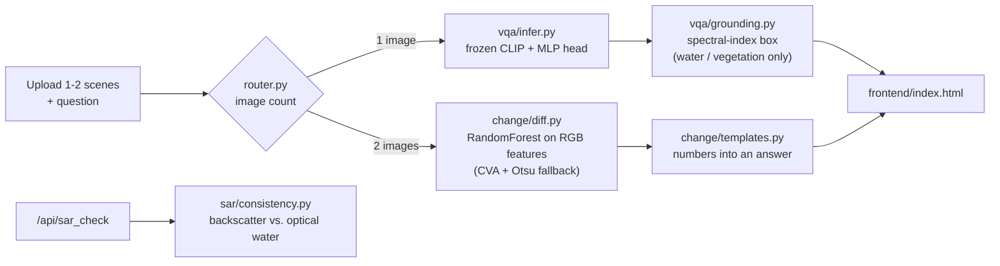

# SatQuery

**Ask a satellite image a question.** Upload one scene and get an answer with visual evidence. Upload two and get a change analysis. One query box, and the system decides which pipeline to run.


Built for ISRO / Space Applications Centre problem statement **SIH26167, "SatQuery AI: an interactive vision-language assistant for multimodal remote sensing image analysis through text queries."**


*Real output on a held-out test pair from OSCD (Sentinel-2). This is the best of the 10 test pairs; the failure case is [further down](#where-it-fails).*

---

## Contents

- [What it does](#what-it-does)
- [How it works](#how-it-works)
- [Results](#results)
- [Where it fails](#where-it-fails)
- [Coverage of the problem statement](#coverage-of-the-problem-statement)
- [Quickstart](#quickstart)
- [API](#api)
- [Project layout](#project-layout)
- [Data and reproduction](#data-and-reproduction)
- [Limitations](#limitations)
- [Why SDG 13](#why-sdg-13)

## What it does

| You provide | The router picks | You get |
|---|---|---|
| 1 scene + a question | Single-image VQA | A short answer (yes/no, rural/urban, or a count range), a confidence score, and, for water/vegetation "yes" answers, a box showing where |
| 2 scenes (before/after) + a question | Change detection | A headline (`7.7% changed`), a plain-language answer, and a map of changed regions with per-region area |
| 1 optical image + 1 Sentinel-1 SAR tile | Optical-SAR check (`/api/sar_check`) | Whether radar backscatter agrees with the optical image about water being present |

Nothing in the answer text is generated by a language model. VQA answers come from a trained classifier, change statistics come from image processing, and the change summary is a template filled with those numbers. That is deliberate: every figure in an answer can be traced to a computation.

## How it works



**VQA.** CLIP ViT-B/32 stays frozen. The image and the question are each embedded, concatenated, and passed to a small MLP that picks one of 9 answers seen in RSVQA-LR. RSVQA-LR asks the rural/urban question with exactly one phrasing, so any rewording is out of distribution and could land on "yes". The classifier's output is therefore masked to the answer group implied by the question (rural/urban, yes/no, or count range).

**Grounding.** Boxes are computed from RGB spectral indices (blue dominance for water, greenness for vegetation), and only for affirmative answers to water and vegetation questions. Buildings, roads and counts get no box, because there is no reliable index for them and a made-up box is worse than none.

**Change detection.** Per-pixel features from the histogram-matched image pair (CVA magnitude, per-channel differences, a greenness delta, and a 5x5 local mean of the magnitude) go to a RandomForest trained on OSCD's 14 training pairs. Connected components of the resulting mask become the reported regions. If the model file is absent, it falls back to an unsupervised Change Vector Analysis with an Otsu threshold.

**SAR check.** A backscatter threshold at -15 dB separates water from everything else, derived from measured Sentinel-1 statistics (table below).

## Results

Every number here was measured on data the model did not train on. Full experiment logs, including the dead ends, are in [`change/EVAL.md`](change/EVAL.md) and [`sar/EVAL.md`](sar/EVAL.md).

### VQA (RSVQA-LR)

| Metric | Value |
|---|---|
| Validation accuracy (10,005 QA pairs, 100 images) | **86.2%** |

Only validation accuracy was recorded. No test-set number and no per-question-type breakdown have been computed yet.

Grounding on a real RSVQA-LR tile. Each box is computed from the spectral index for the noun in the question, and only drawn when the classifier answered "yes":


### Change detection (OSCD, 10 held-out Sentinel-2 test pairs)

| Version | Method | Mean IoU | Precision | Recall |
|---|---|---|---|---|
| v1 | Mean + 1.5 std threshold on RGB difference | 0.162 | 0.388 | 0.231 |
| v2 | + histogram matching | 0.164 | 0.400 | 0.234 |
| v3 | Change Vector Analysis + Otsu threshold | 0.205 | 0.367 | 0.371 |
| **v4 (shipped)** | **RandomForest on 6 RGB features, trained on OSCD train** | **0.269** | **0.433** | **0.526** |

Precision and recall are averaged per image, so the implied F1 of about 0.47 is not directly comparable to published OSCD numbers. For context, recent foundation-model papers report F1 in the 54 to 60 range on this benchmark.

Things that were tried and made it worse, all evaluated on the same 10 pairs:

| Experiment | Mean IoU | Why it failed |
|---|---|---|
| PCA + k-means | 0.122 | k-means has no prior that change is rare; it flagged up to 40% of pixels on a scene with 0.4% real change |
| Sobel edge difference | 0.037 | Real construction edges are too sparse; recall collapsed |
| 10 features (multi-scale + local correlation) | 0.254 | Overfits 14 training scenes |
| + 512 LEVIR-CD pairs (45x more data) | 0.150 | Different sensor and resolution (0.5 m vs 10 m); it swamped the in-domain signal |
| + 30 LEVIR-CD pairs (rebalanced) | 0.242 | Better, still below OSCD-only |

More data and more features both hurt here. The bottleneck is domain match and signal, not volume.

### Optical-SAR check (EuroSAT-SAR, real Sentinel-1 geo-matched to Sentinel-2)

Mean VV backscatter over 30 real tiles per class, which is where the threshold comes from:

| Class | Mean VV (dB) |
|---|---|
| SeaLake (water) | -19.98 |
| AnnualCrop | -11.68 |
| Highway | -10.68 |
| Forest | -9.33 |
| Residential | -8.22 |
| Industrial | -7.01 |

| Evaluation (60 samples: 10 per class, 6 classes) | Accuracy |
|---|---|
| SAR side only, using true class labels (water vs. not-water) | **98%** (59/60) |
| End to end, with the RGB water heuristic reading the optical image | 78% (47/60) |
| 3-way split (water / vegetation / built-up), tried and dropped | 67% |

The gap between 98% and 78% is the optical side, not the radar: the RGB water index misreads forest as water on EuroSAT's JPEG-compressed imagery (Forest: 1/10 correct).

## Where it fails


The three weakest OSCD pairs (01, 02, 06) all have strong seasonal change in farmland. Fields that turned from brown to green between acquisition dates look like construction to a model that only sees RGB, and the ground truth (permanent urban change only) correctly ignores them. Predicted change is 13.6% here against 1.3% in the ground truth. Separating crop cycles from construction needs a NIR band (real NDVI) or far more labeled data. Uploads in this app are ordinary RGB images, so a NIR-based fix is not possible without changing the input format.

Other known weak spots:

- The change model is trained on Sentinel-2. On unlike inputs, such as a flat synthetic patch, it under-detects (2.9% predicted against roughly 5.5% true). The CVA + Otsu fallback handled that case better (5.7%).
- CLIP patch-level zero-shot grounding was tried in three configurations and rejected: it scored real water lowest and farmland highest, so it would have drawn confident boxes in the wrong place.

## Coverage of the problem statement

| Requirement in SIH26167 | Status |
|---|---|
| Natural-language queries on a single image (presence, counts, terrain) | Done for RSVQA-LR's closed vocabulary |
| Localize described features | Partial: water and vegetation only |
| Multitemporal change comparison | Done, with the accuracy above |
| Agentic routing across specialist models | Done (`router.py`), rule-based on image count |
| Optical and SAR analysis | Partial: a binary water-consistency check, not full cross-modal VQA; not in the UI |
| Descriptive captioning | Not built |
| Remote-sensing-adapted VLM, adapted on BigEarthNet | Not built. CLIP is frozen and not fine-tuned on remote sensing data |
| Evaluation on VRSBench and CDVQA | Not done. Neither was used; CDVQA has no public download link |
| ISRO Cartosat-2S / RISAT evaluation set | Not public, not used |

## Quickstart

Requires Python 3.11+ and [uv](https://docs.astral.sh/uv/).

```bash
git clone https://github.com/rhydham-mittal27/satquery.git
cd satquery
uv sync
uv run python server.py      # http://127.0.0.1:8000
```

The first VQA request downloads CLIP ViT-B/32 (about 600 MB) from Hugging Face. The trained models (`vqa/vqa_head.pt`, `vqa/vocab.json`, `change/trained_classifier.joblib`) are in the repo, so no training is needed to run it.

Open the page, click the viewport to load a scene, and ask a question. Use the small "+" tile to add a second scene, and the routing chip shows which pipeline will run before you submit. Inputs should be RGB images (JPG, PNG, or 8-bit RGB GeoTIFF). Multi-band tiles are not supported.

## API

```bash
# One image: VQA
curl -X POST http://127.0.0.1:8000/api/query \
  -F "images=@scene.png" -F "question=Is there a water area?"

# Two images: change detection
curl -X POST http://127.0.0.1:8000/api/query \
  -F "images=@before.png" -F "images=@after.png" -F "question=How much area changed?"

# Optical + Sentinel-1 SAR (2-band VV/VH GeoTIFF)
curl -X POST http://127.0.0.1:8000/api/sar_check \
  -F "optical=@optical.jpg" -F "sar=@sar.tif"
```

| Endpoint | Returns |
|---|---|
| `POST /api/query` | `task_type` (`vqa` or `change`); for `vqa`: `answer`, `confidence`, optional `grounding` (`target`, `box`, `overlay`) and `router_note`; for `change`: `headline`, `answer`, `pct_changed`, `regions[]` (`id`, `area_pct`, `greenness_delta`), `overlay` |
| `POST /api/sar_check` | `sar_mean_db`, `optical_looks_like_water`, `sar_looks_like_water`, `consistent`, `explanation` |
| `POST /api/vqa`, `POST /api/change` | The two pipelines called directly, skipping the router |
| `POST /api/preview` | A contrast-stretched PNG preview (browsers cannot render TIFF) |

If a question sounds like a comparison but only one image was sent, the response still answers it as single-scene VQA and adds a `router_note` explaining why.

## Project layout

```
satquery/
  server.py                    FastAPI app, serves the UI and API
  router.py                    1 image -> VQA, 2 images -> change detection
  frontend/index.html          single-page UI (plain HTML/JS, no build step)
  vqa/
    prepare_data.py            RSVQA-LR loading, count bucketing
    extract_features.py        cache frozen CLIP image/text embeddings
    train_classifier.py        MLP head; writes vqa_head.pt
    infer.py                   answer_vqa(), incl. answer-group masking
    grounding.py               spectral-index boxes for water/vegetation
  change/
    features.py                6 per-pixel RGB features
    diff.py                    detect_change(): trained model or CVA+Otsu
    templates.py               question-aware answer text and headline
    infer.py                   answer_change() + overlay rendering
    trained_classifier.joblib  shipped RandomForest (42 MB)
    EVAL.md                    every experiment, kept and rejected
  sar/
    consistency.py             backscatter vs. optical water check
    EVAL.md                    SAR evaluation
  train_change_classifier.py   train/evaluate the change model
  eval_oscd.py                 score detect_change() on the 10 OSCD test pairs
  extract_oscd.py              OSCD parquet -> before/after/mask PNGs
  docs/make_figures.py         regenerates the figures in this README
```

## Data and reproduction

Datasets are not in the repo. The scripts read them from a `datasets/` folder next to the repo folder (`../datasets/...`).

| Dataset | Used for | Source |
|---|---|---|
| RSVQA-LR | VQA training and validation | Zenodo `10.5281/zenodo.6344334` |
| OSCD (13-band Sentinel-2) | Change model training (14 pairs) and testing (10 pairs) | Hugging Face `blanchon/OSCD_MSI` |
| EuroSAT-SAR | SAR thresholds and evaluation | Hugging Face `wangyi111/EuroSAT-SAR` |
| EuroSAT (optical) | Paired with EuroSAT-SAR by filename | Hugging Face `torchgeo/eurosat` |
| LEVIR-CD | Only the rejected extra-data experiment | Hugging Face `sy2002123/levir-cd` |

```bash
# VQA: cache CLIP features, then train the head
cd vqa
uv run --project .. python prepare_data.py
uv run --project .. python extract_features.py      # slow on CPU (~15 min)
uv run --project .. python train_classifier.py
cd ..

# Change detection: build PNG pairs, train, evaluate
uv run python extract_oscd.py                        # needs the OSCD parquet in datasets/OSCD/data/
uv run python train_change_classifier.py rf
uv run python eval_oscd.py

# Regenerate the README figures
uv run python docs/make_figures.py
```

Two caveats when retraining. `train_change_classifier.py` uses 300 trees at depth 14, while the shipped model was trained with 200 trees at depth 12, so expect similar but not identical numbers. It also writes `change/trained_classifier_rf.joblib`; copy it over `trained_classifier.joblib` to make the app use it.

## Limitations

- **Closed vocabulary.** VQA can only answer with the 9 classes RSVQA-LR contains. It cannot answer open-ended questions or produce captions.
- **10 m/px Sentinel-2 imagery** is what both trained models saw. Very high resolution aerial imagery is out of distribution.
- **Small training set for change detection** (14 scenes). The evaluation set is 10 scenes, so the 0.269 IoU has wide error bars; treat it as a baseline, not a benchmark result.
- **The RGB water/greenness indices are calibrated informally** on RSVQA-LR tiles and do not transfer cleanly to differently processed imagery (see the EuroSAT forest result).
- **The router is a rule** (image count), not a learned or LLM-based agent. It was kept simple on purpose because the signal is unambiguous.
- **The SAR check is not in the UI** and only handles the water question.
- No license file has been added, so the default (all rights reserved) applies until one is.

## Why SDG 13

Change monitoring is the core climate use case: deforestation, flood extent, and urban expansion are all "what changed between these two dates" questions. The pipeline reports how much changed and where, and says so when it cannot tell (diffuse differences with no localizable region are reported as such instead of being forced into a confident answer).

## Acknowledgements

RSVQA-LR (Lobry et al.), OSCD (Daudt et al.), LEVIR-CD (Chen and Shi), EuroSAT (Helber et al.), EuroSAT-SAR (Wang et al.), and CLIP (Radford et al.). Datasets keep their own licenses; check each before redistributing.
